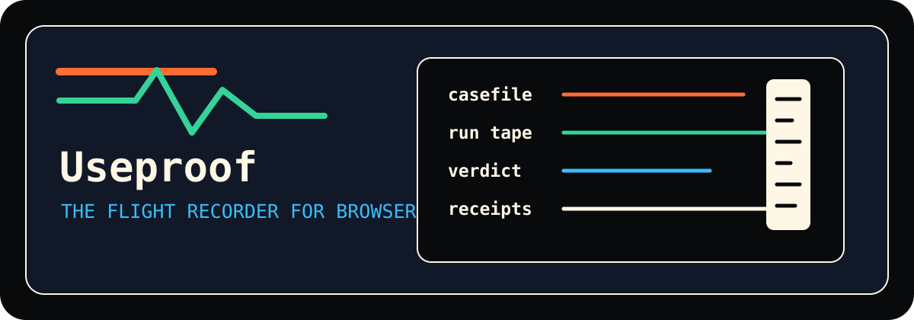

<p align="center">
  
</p>

<h1 align="center">Useproof</h1>

<p align="center">
  <strong>The flight recorder for browser agents.</strong>
</p>

<p align="center">
  Turn agentic web runs into casefiles, verdicts, and receipts your team can inspect.
</p>

<p align="center">
  <a href="LICENSE"></a>
  <a href="pyproject.toml"></a>
  <a href="docs/ROADMAP.md"></a>
</p>

<p align="center">
  
</p>

## Why It Exists

Browser agents are useful until someone asks the hard question:

> What exactly happened, and can we trust it?

Useproof is an open-source product project for answering that question. It runs
agentic browser journeys as **casefiles**, records the run as a **tape**,
checks the outcome as a **verdict**, and saves the evidence as **receipts**.

Useproof starts from the browser automation engine of
[`browser-use`](https://github.com/browser-use/browser-use), then adds a product
layer for repeatable proof runs.

## The Model

```text
casefile -> agent run -> run tape -> verdict -> receipts -> dossier
```

```yaml
case: checkout-smoke-test
objective: Prove that checkout reaches an order confirmation.

agent:
  task: Log in, add the demo product to cart, and complete checkout with the test card.
  model: auto

verdict:
  pass_when:
    - page_contains: Order confirmed
    - url_matches: /orders/
    - capture: confirmation_number

receipts:
  - screenshot
  - run_tape
  - browser_trace
  - dossier
```

Every run should leave a dossier that answers:

- What did the agent do?
- What did it see?
- Why did Useproof pass or fail the casefile?
- Which receipts prove the verdict?
- Can the same casefile run again in CI or on a schedule?

## Product Shape

- `useproof run <casefile.yml>` records a local run tape.
- `useproof check <casefile.yml>` returns a CI verdict.
- `.useproof/cases/` keeps casefiles.
- `.useproof/runs/` keeps tapes, receipts, and dossiers.
- `docs/upstream-archive/` preserves imported upstream context.

The current implementation still exposes the upstream `browser_use` Python
package while Useproof-specific casefile surfaces are introduced.

## Run Locally

```bash
cd useproof
python3.11 -m venv .venv
source .venv/bin/activate
pip install -U pip
pip install -e ".[cli]"
useproof install
useproof doctor
```

Try the current browser-agent CLI:

```bash
useproof open https://example.com
useproof state
useproof screenshot proof.png
useproof close
```

The `run` and `check` casefile commands are the next product layer on the
roadmap. Until then, `useproof` exposes the browser control engine that the
casefile runner will build on.

## Repository Map

- [docs/README.md](docs/README.md): documentation index
- [docs/CASEFILE_SPEC.md](docs/CASEFILE_SPEC.md): casefile format
- [docs/EXAMPLES.md](docs/EXAMPLES.md): example casefiles
- [docs/ARCHITECTURE.md](docs/ARCHITECTURE.md): flight-recorder architecture
- [docs/BRAND.md](docs/BRAND.md): visual and language system
- [docs/ROADMAP.md](docs/ROADMAP.md): build plan
- [docs/UPSTREAM_SNAPSHOT.md](docs/UPSTREAM_SNAPSHOT.md): imported upstream baseline
- [NOTICE.md](NOTICE.md): attribution and license notice

## Development Status

Useproof is in product-shaping mode. The foundation is imported and attributed;
the next work is to build the casefile runner, verdict engine, receipt writer,
and dossier writer around the existing browser agent engine.

## Upstream And License

Useproof is an independent repository, not a GitHub fork. It preserves upstream
history and attribution from `browser-use/browser-use` under the MIT License.

The original upstream README is preserved at
[docs/UPSTREAM_BROWSER_USE_README.md](docs/UPSTREAM_BROWSER_USE_README.md).
